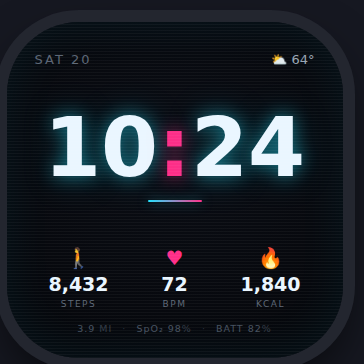

# Neon City — Fitbit Versa 4 Watchface

A cyberpunk **cyan × magenta** clock face for the Fitbit Versa 4 (336×336 AMOLED),
built for Dheeraj. Deep negative space on a true-black ground, a hero digital time
with a layered cyan bloom and a magenta colon, a cyan→magenta accent rule, and a
supporting trio of steps / heart rate / calories over a hairline micro-row
(distance · SpO₂ · battery). Ships a dimmed **Always-On** variant.

<p align="center">
  
</p>

## Project layout

```
app/index.js          # Device-side clock face logic (time, stats, HR, AOD)
common/utils.js       # Shared helpers (zeroPad, commas, date, miles)
resources/
  index.view          # SVG layout — #live + #aod groups (SDK >= 5 entry file)
  widget.defs         # system-widget imports (required by SDK >= 5; none used here)
  styles.css          # Styling (auto-applied)
  *.png               # Generated assets (see scripts/gen-assets.js)
scripts/gen-assets.js # Procedurally generates all PNGs (icons, scanlines, app icon)
preview/index.html    # Browser preview of the face (live + AOD, with toggles)
test/                 # Structural (render) + unit (utils) tests, run with node --test
package.json          # Fitbit app manifest + dependencies
```

## Getting started

```bash
npm install              # install the Fitbit SDK + CLI
npm run gen-assets       # (re)generate resources/*.png
npm test                 # run structural + unit tests
npx fitbit-build         # build the .fba package
npx fitbit               # open the interactive CLI shell (build-and-install)
```

You'll need to be signed in (`login`) with the Fitbit Simulator running or a device
connected via the Fitbit mobile app's Developer Bridge.

## Design tokens

| Role | Value |
|------|-------|
| Base | `#05060A` (radial center `#0A0D14`) |
| Cyan | `#1FE3FF` |
| Magenta | `#FF2E88` |
| Text | `#EAF6FF` |
| Muted | `#5C6675` |

The palette lives in `scripts/gen-assets.js` (icon colors) and `resources/styles.css`
(text colors); the preview mirrors it in its `:root`. A `render.test` assertion guards
that the core hexes stay present in the stylesheet.

## On-device fidelity notes

Fitbit OS is more limited than the browser, so the device build approximates the
design in a few documented ways:

- **Glow** — there is no SVG blur / `text-shadow`, so the cyan/magenta bloom is faked
  with stacked low-opacity copies of the time (`.glow1` / `.glow2` / `.colonGlow`).
- **Font** — Fitbit OS can't embed TTFs (only `System-Regular/Light/Bold` exist), so
  the hero time's numerals are **pre-rendered Chakra Petch glyph images**
  (`resources/digit-*.png` + `colon.png`, regenerate with `scripts/gen-time-font.sh`);
  `app/index.js` swaps each digit slot's `href`. The smaller date / stats / labels use
  the built-in `System-Bold`.
- **Accent rule** — a real `<gradientRect>` (Fitbit's gradient primitive), squared ends.
- **Weather** — no clock-face API exposes it; a companion would push it over the
  Messaging API. Until real data arrives the **entire weather section is hidden**
  (no stale placeholder) — see `setWeather()` in `app/index.js`. **SpO₂** stays a
  static placeholder for now.

## Always-On display (AOD)

A dimmed AOD view (thin ~50%-luminance time + heart rate only, no magenta, glow or
scanlines) is fully implemented but currently disabled for distribution — the `#aod` group in
`resources/index.view`, its styles, and the `display`-event toggling in `app/index.js`.

> ⚠️ **AOD is currently disabled for distribution.** `access_aod` is authorization-gated
> by Fitbit: it only activates in the Simulator or an authorized App Gallery build, and
> AOD clock faces **cannot be sideloaded**. To keep this face installable via the Gallery
> or via sideloading, `access_aod` is **omitted** from `requestedPermissions`. With the
> permission absent, `display.aodAvailable` is `false`, so the code stays dormant and the
> normal live face always shows. To re-enable AOD once Fitbit grants authorization, add
> `"access_aod"` back to `requestedPermissions` in `package.json` and rebuild — no other
> changes needed.

## Customizing

- **Colors** — edit the palette in `scripts/gen-assets.js` (then `npm run gen-assets`)
  and `resources/styles.css`.
- **Layout** — edit `resources/index.view` (absolute coordinates on the 336×336 screen).
- **Icons** — the steps / heart / flame / weather glyphs are drawn procedurally in
  `scripts/gen-assets.js`; tweak the shape predicates and regenerate.
- **Data** — `app/index.js` reads steps/calories/distance from `user-activity`, BPM
  from the `heart-rate` sensor, and battery from `power`.
